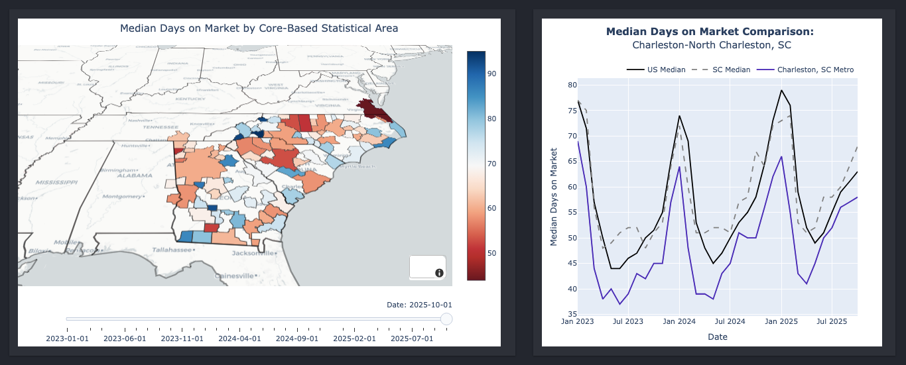
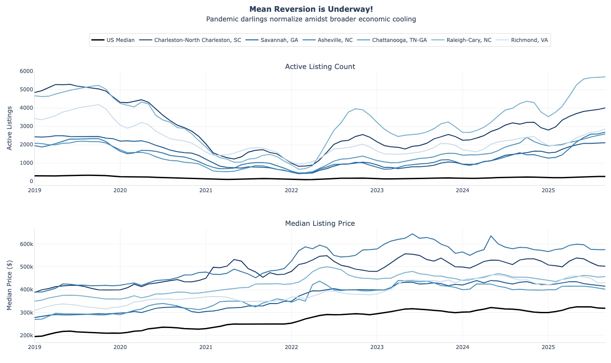
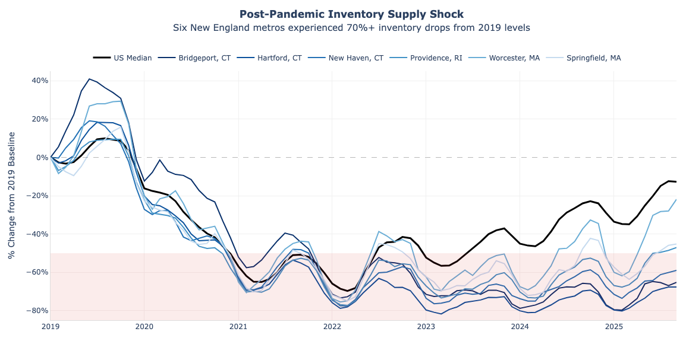
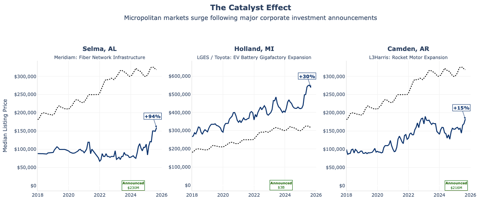
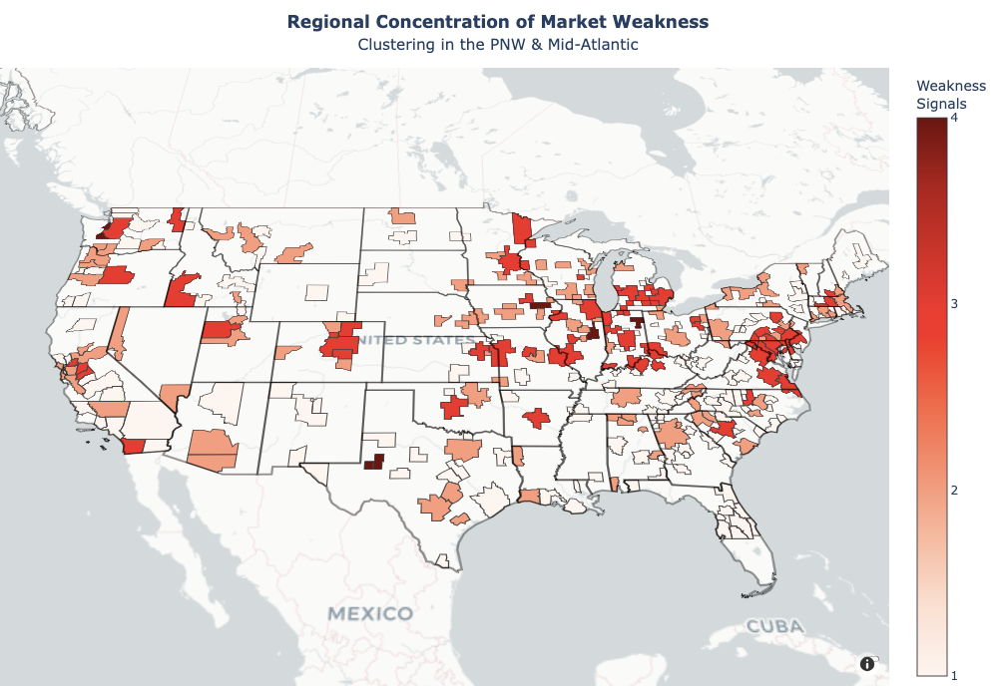
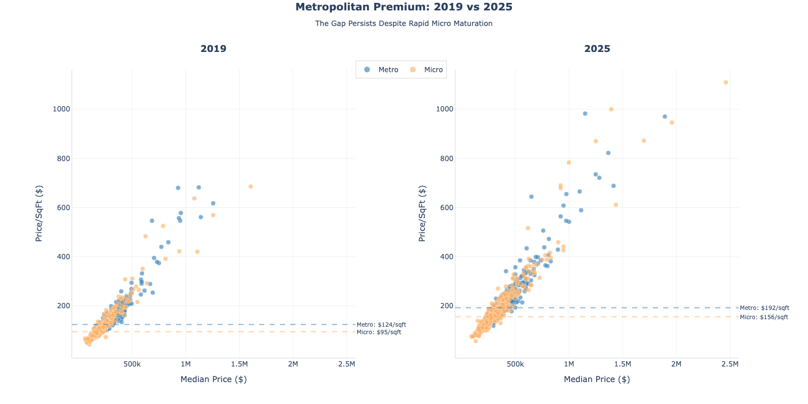
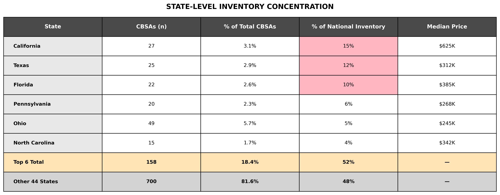

# CBSA Real Estate Market Analytics Dashboard

> To see more of my work, visit my [Portfolio](https://tjnorman.xyz/).

**Table of Contents**

- [Executive Summary](#executive-summary)
- [Insights Deep-Dive](#insights-deep-dive)
- [Market Opportunity Thesis](#market-opportunity-thesis)
- [Technical Implementation](#technical-implementation)
- [Assumptions and Caveats](#assumptions-and-caveats)
 

***

## Executive Summary

Analysis through September 2025 reveals housing operating under structural supply constraints in a post-ZIRP environment, despite normalizing absorption rates. Segmentation analysis indicates that the composition of the local economic base now supersedes regional geography as a driver of market performance. 

**Key Findings:**
- **Metropolitan Premium:** Metro areas command a structural 30% price premium ($356K vs $273K) over micropolitan markets, driven by land value and job quality
- **Emerging Tech Markets:** Austin, Nashville, and Charlotte delivered strong appreciation by decoupling from national trends through diversified tech/healthcare employment
- **Supply Shock:** Active listings remain 70% below 2019 baselines in Northeast metros (Bridgeport -72%, Hartford -70%), indicating rate-induced lock-in effects
- **Inventory Concentration Bias:** Six states (CA, TX, FL, PA, OH, NC) control 52% of national inventory despite representing 22% of CBSAs, skewing headline aggregate metrics

**Next-Gen Innovation Hubs** 
Emerging metros like Charlotte represent the new frontier of sustainable growth. Delivering 18-24% appreciation in the post-pandemic boom, these metros have benefitted from strong sector fundamentals, including robust job growth and diversified economic bases. This is in stark contrast to legacy tech markets like San Francisco which have experienced constricted price appreciation (<1% annually) due to affordability constraints and growing inventories. 

**Hospitality-Driven Markets** 
Cape Coral and Myrtle Beach emerged as pandemic winners, with inventory dropping 50% and price surges exceeding 30%. Paradoxically, listings in these markets have been sitting 42% longer than the aggregate, which typically signals weakness. However, deeper analysis reveals that sellers' markets are now characterized by **pricing power** rather than transaction speed. Sellers command premiums but must wait longer for buyers willing to pay those prices.

## Insights Deep-Dive

### National Market Health

**Stabilization and Normalized Velocity**: The post-pandemic frenzy has subsided into a stable, albeit constrained, equilibrium. Year-over-year price growth has stabilized at 2-3% across most markets, while median days-on-market (DOM) has effectively doubled from the 25-35 day lows of 2021 to reach 61 days. Despite this slowing velocity, the national market remains fundamentally undersupplied with only 2.9 months of inventory, significantly below the 4-6 month threshold of a balanced market.

**The Inventory Shortage**: Active listing counts remain 70% below 2019 baselines in multiple New England metros (Bridgeport -72%, Hartford -70%), indicating structural constraints beyond cyclical factors. A supply shock of this magnitude can't be attributed to supply and demand imbalances alone. The constraint likely stems from rate-induced lock-in effects, where existing homeowners lost refinancing incentives and purchasing power.

**Localized Growth Shocks**: While broad-based appreciation has cooled, specific micropolitan markets are seeing explosive YoY price growth (Selma, AL +89%; Camden, AR +43%). Unlike the pandemic's "Zoom town" phenomenon, this growth appears driven by capital-intensive corporate activity seeking lower operating costs, creating localized demand shocks in otherwise quiet markets.

**Broad-Based Market Recalibration**: Currently, 91 major markets exhibit 3+ simultaneous weakness signals concentrated in Midwest metros (Indianapolis, Columbus, Evansville) and Pacific Northwest markets (Eugene, Olympia, Portland). In contrast, only 2 markets show 3+ strength signals. This developing weakness marks the first widespread cooldown in over a decade, reinforcing the primacy of conservative underwriting and income fundamentals.

### The Aggregate Illusion

**The Metropolitan Premium**: US aggregate metrics mask extreme performance disparities between metropolitan and micropolitan markets. Metropolitan areas command a 30% premium ($356K) over micropolitan markets ($273K), a divergence mirrored in median price-per-square-foot data ($195/sqft vs $145/sqft). This alignment across both absolute and unit metrics shows the metropolitan premium is structural, driven fundamentally by supply constraints and thereby, land value.

**Inventory Concentration Bias**: Census region analysis reveals an 83% price differential between West ($500K median) and Midwest ($274K median), dwarfing the 18% coastal-interior premium. Six states (CA, TX, FL, PA, OH, NC) control 52% of national inventory despite representing 22% of CBSAs, creating noteworthy skew in headline aggregate metrics. California alone contributes 15% of inventory from just 27 markets, while Ohio's 49 markets contribute only 5%. National aggregate metrics disproportionately reflect California, Texas, and Florida dynamics while systematically underrepresenting patterns in the broader market.

## Market Opportunity Thesis

*Analysis based on data collected in Q3 2025.*

### Capitalize on Tech Decentralization

Markets with diversified technology and healthcare employment bases are decoupling from national trends, averaging 2-3% higher YoY appreciation than national benchmarks. Clustering analysis reveals that economic base quality, specifically wage growth relative to housing costs, separates resilient markets from those experiencing demand erosion. Unlike legacy tech markets facing affordability ceilings, these next-generation hubs demonstrate sustained absorption without Silicon Valley valuations.

**Raleigh, NC** exemplifies this pattern, posting 4.2% YoY appreciation despite the broader national cooling. This positions next-gen knowledge hubs as strong medium-term opportunities where income fundamentals justify current valuations. 
*Thesis Risk: Affordability compression if wage growth decelerates, though downside remains limited compared to hospitality-driven markets*

### Value Opportunities in Rust Belt Revitalization

Manufacturing-heavy metros bifurcate cleanly: markets like Columbus, OH and Indianapolis, IN demonstrate DOM compression alongside rising supply scores, indicating strong demand absorbing increased building activity. This self-reinforcing dynamic creates a clear divergence from stagnant markets like Detroit, MI and Milwaukee, WI. Below-median pricing provides appreciation runway even if these markets simply converge toward national averages, creating significant value opportunities.

**Columbus, OH** maintains robust absorption with pending/active ratios consistently above 0.55, creating prime conditions for 3-5 year forced appreciation strategies to outperform benchmarks. With wage-driven demand sustaining pricing power, a dovish Fed turns already favorable fundamentals into an asymmetric risk/reward opportunity. 
*Thesis Risk: Manufacturing cyclicality introduces volatility, though strong wage trajectories and modern industry diversification buffers against broader Rust Belt stagnation.*

### Avoid Pacific Northwest Overvaluation

Pacific Northwest tech markets now trade at valuation multiples where comparable employment quality exists at 30-40% discounts in emerging hubs. Surging price-cut activity in Seattle and Portland signals buyer hesitation at current prices. Capital allocated here faces extended hold periods with compressed returns compared to emerging tech metros offering comparable fundamentals at earlier lifecycle stages.

**Seattle, WA** ($725K median) faces rotation pressure toward markets like Austin or Charlotte, which offer similar industry mix and wage growth trajectories at materially lower entry points. 
*Thesis Risk: Emerging markets may fail to sustain recent momentum, reversing skilled labor migration patterns.*

## Technical Implementation

### Architecture Overview

The application follows a decoupled pipeline-frontend pattern: a standalone Python ETL process handles data ingestion and transformation, while a Dash/Plotly interface serves interactive visualizations. This modular design separates data logic from presentation, allowing for portable deployment without heavy database infrastructure.

### Data Schema

### Data Pipeline (ETL)

An incremental update strategy minimizes API load and ensures data consistency:

1.  **Fetch Stage**: Queries FRED API for latest observations, implementing rate limiting (120 req/min) and retry logic with exponential backoff (`data_pipeline/fetch_latest_fred_data.py`).
2.  **Process Stage**: Merges new data with existing historical sets and computes MoM/YoY derivatives, using Parquet for efficient I/O and schema enforcement (`data_pipeline/process_latest_fred_data.py`).
3.  **Aggregate Stage**: Computes US and state-level medians from the CBSA granular data to support robust benchmarks (`data_pipeline/update_aggregates.py`).

*Orchestration provided by `data_pipeline/run_pipeline.py`*

**Note:** Market segmentation logic has been excluded from this public repository.

### Performance Optimizations

-   **Server-Side Caching**: Flask-Caching stores computed map frames, eliminating redundant recalculation for common filter combinations (e.g., "Texas" + "Price").
-   **Payload Reduction**: Animation frames exclude redundant GeoJSON geometry, reducing frame size by >95% per frame update.

## Assumptions and Caveats

### Data Quality and Coverage

- **FRED API Limitations**: Data availability varies by CBSA and metric; smaller micropolitan areas may have incomplete time series or delayed updates.
- **Realtor.com Source**: Base Metrics reflect data that FRED sources from Realtor.com, representing a large but not exhaustive sample of U.S. housing inventory.
- **Reporting Lag**: FRED data is typically published 30-45 days after period end; dashboard shows latest available data.
- **Seasonal Adjustment**: Raw data preserves seasonal patterns to highlight cyclical market behavior; no deseasonalization applied.
- **Ratio Metrics for Small Markets**: Price decrease/increase ratios can be volatile in low-inventory markets.

### Technical Limitations

- **Cache Expiration**: Computed map frames cached for 1 hour; initial load after inactivity may take 2-4 seconds.
- **GeoJSON Precision**: CBSA boundaries simplified to 20m resolution to optimize rendering speed; high-fidelity borders are unnecessary for regional-level visualization.
***

For more projects and to connect, visit my [portfolio website](https://tjnorman.xyz/).
